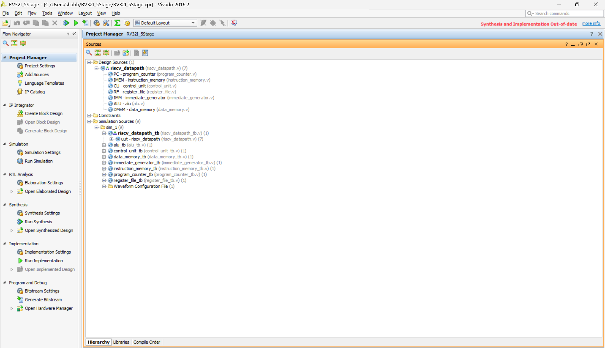
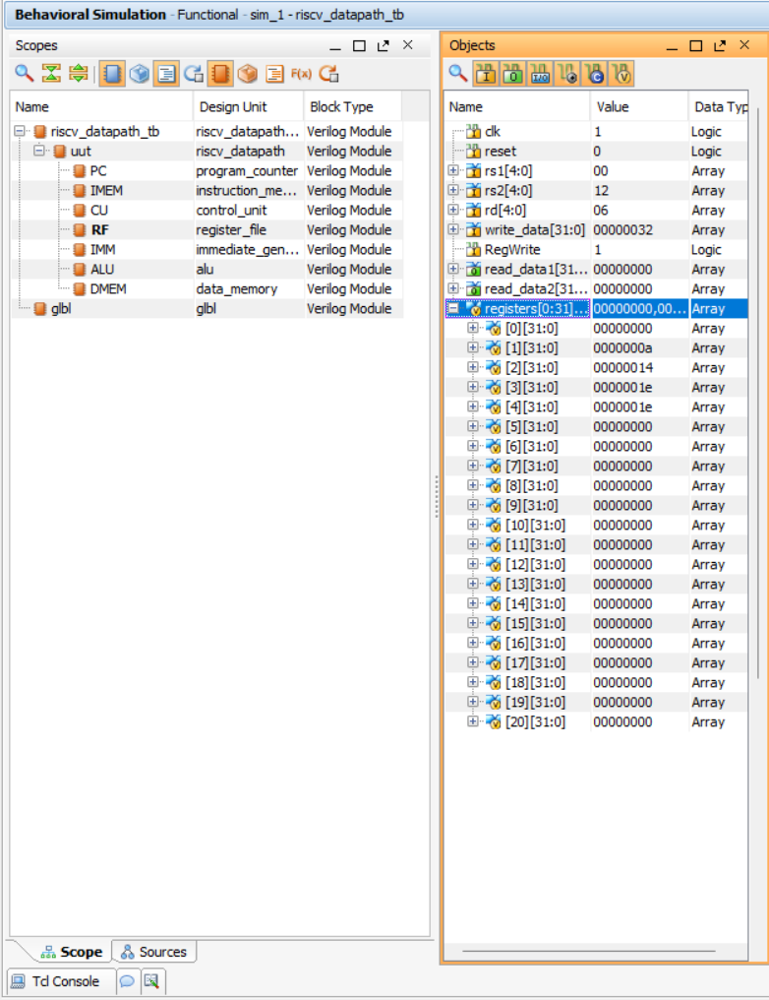
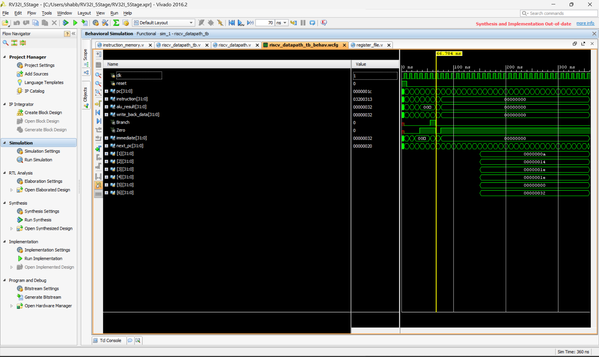
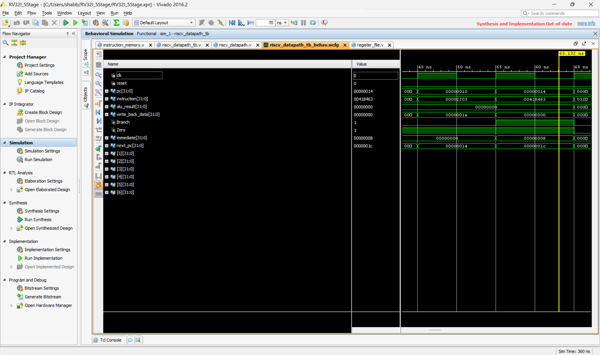
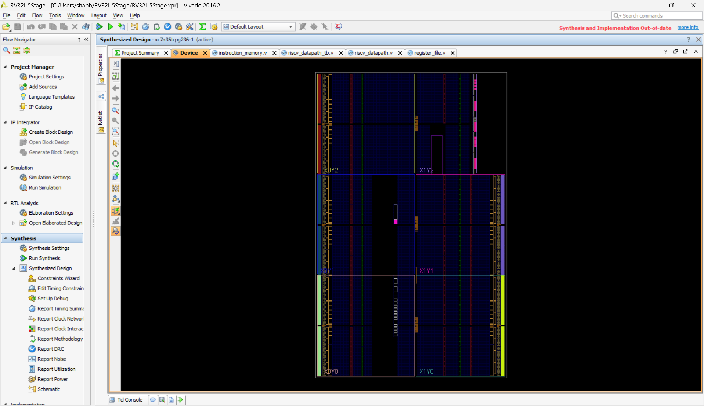

# RV32I 5-Stage RISC-V Datapath

## Project Overview
This project presents the design and functional simulation of a 32-bit RISC-V RV32I datapath using Verilog HDL and Xilinx Vivado.

The datapath is designed to demonstrate the execution of basic RISC-V instructions including arithmetic operations, memory access operations, immediate instructions, and conditional branch instructions.

The project focuses on understanding the internal operation of a RISC-V processor datapath and verifying its functionality through behavioral simulation and waveform analysis.

## Architecture
The design consists of the following major components:

- Program Counter (PC)
- Instruction Memory (IMEM)
- Control Unit (CU)
- Register File (RF)
- Immediate Generator (IMM)
- Arithmetic Logic Unit (ALU)
- Data Memory (DMEM)
- Multiplexers
- Branch Logic

These components are interconnected to form the RISC-V datapath.

### RTL Design Hierarchy


### RTL Datapath Schematic


## Verilog Modules
The project contains the following main Verilog modules:

### 1. `program_counter.v`
The Program Counter stores the address of the current instruction and updates it on every clock cycle.

### 2. `instruction_memory.v`
The Instruction Memory stores the RISC-V instructions used for testing the datapath.

The implemented instruction sequence includes:
- ADDI
- ADD
- SW
- LW
- BEQ
- ADDI

### 3. `control_unit.v`
The Control Unit decodes the opcode of the current instruction and generates the required control signals for the datapath.

Important control signals include:
- RegWrite
- MemRead
- MemWrite
- MemToReg
- ALUSrc
- Branch
- ALUControl

### 4. `register_file.v`
The Register File contains 32 registers of 32 bits each.

It provides two read ports and one write port and is used to store intermediate results during instruction execution.

### 5. `immediate_generator.v`
The Immediate Generator extracts and sign-extends immediate values from RISC-V instructions.

It supports the immediate formats required by the implemented instructions.

### 6. `alu.v`
The Arithmetic Logic Unit performs arithmetic and logical operations required by the instructions.

It also generates the Zero signal used for conditional branch decisions.

### 7. `data_memory.v`
The Data Memory is used for load and store operations.

The implemented test program uses:
- SW — Store Word
- LW — Load Word

### 8. `riscv_datapath.v`
This is the top-level datapath module that connects all the individual components together.

## Instruction Sequence
The Instruction Memory contains the following test program:

| Address | Instruction         |
|---------|----------------------|
| 0       | ADDI x1, x0, 10      |
| 4       | ADDI x2, x0, 20      |
| 8       | ADD  x3, x1, x2      |
| 12      | SW   x3, 0(x0)       |
| 16      | LW   x4, 0(x0)       |
| 20      | BEQ  x3, x4, +8      |
| 24      | ADDI x5, x0, 99      |
| 28      | ADDI x6, x0, 50      |

## Instruction Execution

**ADDI x1, x0, 10**
The first instruction adds the immediate value 10 to register x0 and stores the result in x1.
```
x1 = 10
```

**ADDI x2, x0, 20**
The second instruction adds the immediate value 20 to register x0 and stores the result in x2.
```
x2 = 20
```

**ADD x3, x1, x2**
The third instruction adds the contents of x1 and x2.
```
x3 = x1 + x2
x3 = 10 + 20
x3 = 30
```

**SW x3, 0(x0)**
The value stored in x3 is written to data memory at address 0.
```
Memory[0] = 30
```

**LW x4, 0(x0)**
The value stored at memory address 0 is loaded into register x4.
```
x4 = 30
```

**BEQ x3, x4, +8**
The BEQ instruction checks whether x3 and x4 contain the same value.

Since:
```
x3 = 30
x4 = 30
```

the branch condition becomes true and the instruction at address 24 is skipped.

The Program Counter therefore changes from:
```
20 → 28
```
instead of:
```
20 → 24
```

This verifies the conditional branch operation of the datapath.

## Simulation

The design was functionally simulated using Xilinx Vivado.

Important signals observed during simulation include:
- Clock
- Reset
- Program Counter
- Instruction
- ALU Result
- Write-Back Data
- Branch
- Zero
- Immediate
- Next PC

### Simulation Waveform


**Expected PC Execution:**
```
PC: 0 → 4 → 8 → 12 → 16 → 20 → 28
```
The transition from 20 to 28 demonstrates successful branch operation.

## Register File Verification

The simulation demonstrates the following register values:

| Register | Value |
|----------|-------|
| x1       | 10    |
| x2       | 20    |
| x3       | 30    |
| x4       | 30    |
| x5       | 0     |
| x6       | 50    |

The values confirm the execution of the arithmetic, load/store, and branch instructions.

The value of x5 remains 0 because the instruction at address 24 is skipped by the successful BEQ instruction.

### Register File Verification (Waveform)


## Memory Operation Verification

The store and load operations are verified through the following sequence:

```
x3 = 30
   ↓
SW x3, 0(x0)
   ↓
Memory[0] = 30
   ↓
LW x4, 0(x0)
   ↓
x4 = 30
```

This demonstrates successful data transfer between the register file and data memory.

## Branch Verification

The branch operation is verified using the Zero and Branch control signals.

For the BEQ x3, x4, +8 instruction:
```
x3 = 30
x4 = 30
```

Therefore:
```
ALU comparison result = 0
Zero = 1
Branch = 1
```

The branch condition is satisfied and the next PC becomes:
```
20 + 8 = 28
```

Thus, the instruction at address 24 is skipped.

## Tools Used
- Verilog HDL
- Xilinx Vivado
- Behavioral Simulation
- RTL Schematic
- Waveform Analysis

## Key Features
- 32-bit RISC-V datapath
- RV32I instruction execution
- Program Counter implementation
- Instruction Memory
- Register File
- Immediate Generator
- Arithmetic Logic Unit
- Data Memory
- Arithmetic operations
- Immediate operations
- Register read/write operations
- Load and store operations
- Conditional branch operation
- Branch comparison using Zero signal
- Functional simulation and waveform verification
- RTL schematic verification

## Project Verification

The design was verified using behavioral simulation in Xilinx Vivado.

The simulation confirms:
```
ADDI operation
     ↓
Register update
     ↓
ADD operation
     ↓
Store to memory
     ↓
Load from memory
     ↓
Register comparison
     ↓
Successful BEQ branch
```

The expected Program Counter sequence is:
```
0 → 4 → 8 → 12 → 16 → 20 → 28
```

The register values after execution include:

| Register | Value |
|----------|-------|
| x1       | 10    |
| x2       | 20    |
| x3       | 30    |
| x4       | 30    |
| x5       | 0     |
| x6       | 50    |

These results demonstrate the functional operation of the implemented RISC-V datapath.

## Synthesized Design

### Synthesized Design View


## Project Status

Functional simulation completed successfully with verification of:
- Datapath operation
- Instruction execution
- Register updates
- ALU operation
- Memory operations
- Immediate generation
- Conditional branch behavior
- Program Counter update
- RTL connectivity

## Project Screenshots

The repository includes simulation and design screenshots demonstrating:
- RISC-V datapath behavioral simulation waveform
- Program Counter and branch waveform
- Register File values
- RTL schematic of the datapath
- Vivado synthesized design

These screenshots provide visual verification of the implemented design.

## Author

Shabbir Shaik
